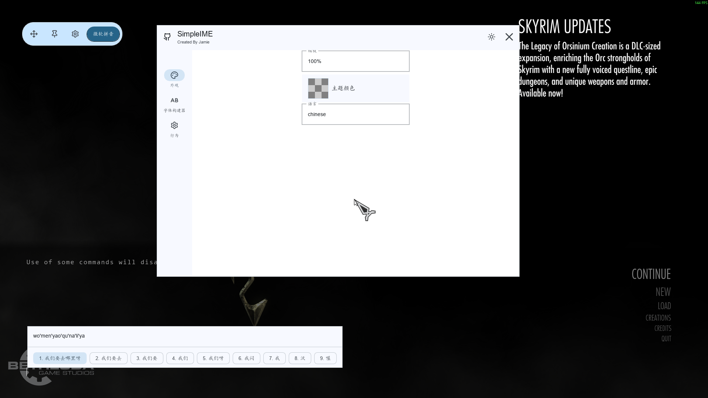

# SimpleIME

Native IME (Input Method Editor) support for Skyrim SE/AE — type Chinese, Japanese, Korean and
other multi-byte languages in the game console and any text field.

[](https://www.nexusmods.com/skyrimspecialedition/mods/140136)

## Features

- TSF-based IME integration with candidate list and composition display
- Follows the in-game text cursor automatically
- Dynamic theming via Material You (seed-color → full palette)
- Fully translatable UI (`.toml` translation files, hot-reload)
- Font picker: choose any installed or local font per script (Latin / CJK / emoji)

## Environment variables

| Variable        | Description                                                              |
|-----------------|--------------------------------------------------------------------------|
| `VCPKG_ROOT`    | Path to your vcpkg installation (required)                               |
| `MO2_MODS_PATH` | _(Optional)_ MO2 mods folder — build output is copied here automatically |

## Configure

**Debug** (default for development):
```shell
cmake --preset simple-ime-debug-clangcl-ninja-vcpkg
```

**Release with debug info** (for distribution testing):
```shell
cmake --preset simple-ime-RelWithDebInfo-clangcl-ninja-vcpkg
```

## Build

```shell
# configure first if not done yet
cmake --preset simple-ime-debug-clangcl-ninja-vcpkg

# build the plugin
cmake --build --preset simple-ime-debug-clangcl-ninja-vcpkg --target SimpleIME

# package (creates the mod archive)
cpack --config build/simple-ime-debug-clangcl-ninja-vcpkg/CPackConfig.cmake
```

For a release build substitute `simple-ime-debug-clangcl-ninja-vcpkg` with
`simple-ime-relwithdebinfo-clangcl-ninja-vcpkg` or `simple-ime-release-clangcl-ninja-vcpkg`.

## Test

Tests are off by default. Pass `-DBUILD_TESTING=ON` at configure time:

```shell
cmake --preset simple-ime-debug-clangcl-ninja-vcpkg -DBUILD_TESTING=ON
cmake --build --preset simple-ime-debug-clangcl-ninja-vcpkg --target SimpleIMETest
ctest --test-dir build/simple-ime-debug-clangcl-ninja-vcpkg/SimpleIME
```

## Configuration

- **Zero-config required** — the mod runs without a config file. Missing or malformed values fall back to built-in defaults automatically.
- **Auto-save on exit** — SimpleIME rewrites the config file when the game exits, normalising any manual edits.
- **MO2 users** — the generated/updated `SimpleIME.toml` may appear in your **Overwrite** folder rather than the mod's own directory.

## Contributing

### Configuration file

The canonical source for all default values is `GetDefaultSettings()` in the code.
When you add or change a config key, update that function first; the `.toml` file in
`contrib/config/` is derived from it, not the other way around.

To regenerate `contrib/config/SimpleIME.toml` with current defaults:

1. Delete the existing `SimpleIME.toml` from the game's plugin interface directory.
2. Launch the game once — SimpleIME writes a fresh file on game quit with all defaults.
3. Copy the generated file to `contrib/config/SimpleIME.toml`.

> **MO2 users:** the generated file may land in your **Overwrite** folder instead.

## Known issues

### Crash during composition when switching windows via Win+Shift+S

**Trigger:** While a CJK composition is in progress, press **Win+Shift+S** (Snipping Tool) and switch
focus to another window at the right moment before the capture completes.

**Symptom:** SimpleIME crashes. No PDB is available for that scenario, so the exact call site and
root cause are unknown.

**Hypothesis:** TSF or IMM32 posts a composition-end message that arrives after ImeWnd or its
related objects have started tearing down, causing a use-after-free or null-deref inside
`WM_KILLFOCUS` handling.

## Architecture notes

See [`docs/adr/`](docs/adr/) for Architecture Decision Records.

## Gallery


