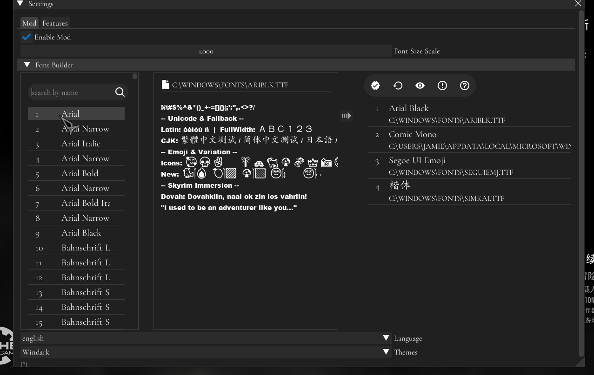

## Environment Varibles

`MO2_MODS_PATH`: The [ModOrganizer2](https://www.modorganizer.org/) mods folder. The `dll`, `pdb` and other required filed will auto copy to `MO2_MODS_PATH/{PLUGIN_NAME}` folder when build successful if seup this env varible;

## Configure CMake

```shell
cmake.exe -DCMAKE_BUILD_TYPE=Debug --preset debug-clangcl-ninjia-vcpkg -S . -B /build/debug-clangcl-ninjia-vcpkg
```

## Build
```shell
cmake --preset debug-clangcl-ninjia-vcpkg
cmake --build build\debug-clangcl-ninjia-vcpkg --target SimpleIME
cd build\debug-clangcl-ninjia-vcpkg
cpack
```
## Test

```shell
cmake --build build\debug-clangcl-ninjia-vcpkg --target SimpleIMETest
cd build\debug-clangcl-ninjia-vcpkg\SimpleIME && ctest
```

## Gallery

### FontBuilder


