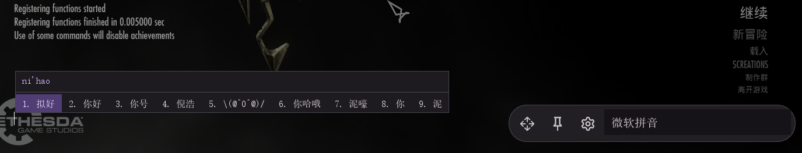

# SimpleIME

Native IME (Input Method Editor) support for Skyrim SE/AE — type Chinese, Japanese, Korean and
other multi-byte languages in the game console and any text field.

[](https://www.nexusmods.com/skyrimspecialedition/mods/140136)

## Features

- TSF-based IME integration with candidate list and composition display
- Follows the in-game text cursor automatically
- Dynamic theming via Material You (seed-color → full palette)
- Fully translatable UI (`.toml` translation files, hot-reload)
- Font picker: choose any installed or local font per script (Latin / CJK / emoji)

## Environment variables

| Variable | Description |
|----------|-------------|
| `VCPKG_ROOT` | Path to your vcpkg installation (required) |
| `MO2_MODS_PATH` | _(Optional)_ MO2 mods folder — build output is copied here automatically |

## Configure

**Debug** (default for development):
```shell
cmake --preset debug-clangcl-ninja-vcpkg
```

**Release with debug info** (for distribution testing):
```shell
cmake --preset RelWithDebInfo-clangcl-ninja-vcpkg
```

## Build

```shell
# configure first if not done yet
cmake --preset debug-clangcl-ninja-vcpkg

# build the plugin
cmake --build --preset build-debug-clangcl-ninja-vcpkg --target SimpleIME

# package (creates the mod archive)
cpack --config build/debug-clangcl-ninja-vcpkg/CPackConfig.cmake
```

For a release build substitute `build-debug-clangcl-ninja-vcpkg` with
`build-relwithdebinfo-clangcl-ninja-vcpkg` or `build-release-clangcl-ninja-vcpkg`.

## Test

Tests are off by default. Pass `-DBUILD_TESTING=ON` at configure time:

```shell
cmake --preset debug-clangcl-ninja-vcpkg -DBUILD_TESTING=ON
cmake --build --preset build-debug-clangcl-ninja-vcpkg --target SimpleIMETest
ctest --test-dir build/debug-clangcl-ninja-vcpkg/SimpleIME
```

## Architecture notes

See [`docs/adr/`](docs/adr/) for Architecture Decision Records.

## Gallery

### IME Window & Language Bar


